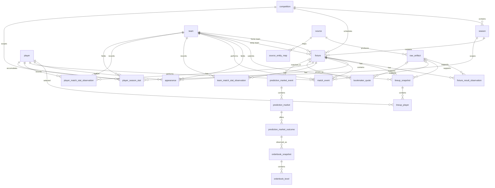

# Soccer Polymarket Model — Data Architecture

Status: initial source probes validated; schema mapping still provisional
Date: 2 July 2026
Related document: [DATA_SOURCE_AUDIT.md](./DATA_SOURCE_AUDIT.md)

Validation report: [reports/SOURCE_VALIDATION_REPORT.md](./reports/SOURCE_VALIDATION_REPORT.md)

### Initial validation update

The first live probes confirmed that the architecture can represent the selected sources without discarding required information:

- API-Football returned current fixtures, complete World Cup lineups, event timelines, player match statistics, team corners, and team expected goals.
- StatsBomb Open Data returned 64 World Cup 2022 matches plus rich lineups and 4,407 events for the sampled final.
- Football-Data.co.uk returned 760 team-match rows across two Premier League seasons with scores, shots, corners, moneyline odds, and handicap fields.
- Understat returned 537 EPL 2025/26 player-season rows with minutes, goals, assists, shots, xG, xA, and related attacking features.
- Polymarket Gamma and CLOB returned a matched Spain–Austria moneyline event, a populated order book, and price history without authentication.
- API-Football requires paced requests; an unpaced probe encountered HTTP 429 before the daily quota was exhausted.

These results validate the layered storage design. They do not yet establish full historical or competition-wide completeness.

### Historical warehouse update

The first curated backfill has now been normalized into DuckDB:

- 22,297 canonical fixtures covering the top five European leagues from 2014/15 through 2025/26 where available, plus current API and StatsBomb samples;
- 39,815 source-specific result observations;
- 79,256 team-match statistic observations;
- 32,574 player-season observations covering 9,484 canonical players;
- 190,839 historical bookmaker quotes;
- 4,420 detailed match events;
- 3,885 Polymarket markets and 7,770 outcome tokens.

Football-Data.co.uk and Understat now share 17,879 canonical fixture identities. This is 99.7% of the Football-Data fixtures in their intended overlapping scope; the residual differences are retained as separate records pending date/source reconciliation rather than forced together. The current warehouse has no open blocking quality issues. See [reports/DATABASE_COVERAGE_REPORT.md](./reports/DATABASE_COVERAGE_REPORT.md).

## 1. Purpose

This document defines the permanent local data foundation for the soccer forecasting and Polymarket comparison system. It covers:

- how source responses are retained;
- how heterogeneous providers map into one canonical schema;
- how duplicate and conflicting records are handled;
- how collection stays inside API limits;
- how historical data becomes reproducible model-training datasets;
- how information available at prediction time is separated from information learned later.

This is a logical architecture. Exact provider field mappings will be added after representative API and scraper responses are inspected.

## 2. Assumptions

The initial implementation assumes:

1. One user runs the system locally.
2. Python is the ingestion, transformation, and modeling language.
3. DuckDB is the canonical analytical database.
4. Parquet stores large, immutable analytical datasets.
5. Raw source responses are stored compressed and unchanged.
6. Both club and national-team matches are in scope.
7. Free data sources and their usage limits are the default constraint.
8. Pre-match forecasting is the first operational mode; live/in-play modeling can reuse the architecture later.
9. Automated trading is outside the initial data layer, but the schema must not prevent it.
10. All predictions must be reproducible from information that was available before their declared cutoff time.

## 3. Architectural principles

### 3.1 Preserve source truth

Normalization must never destroy the original source response. Parsed values can be corrected later because the raw artifact remains available.

### 3.2 Use internal identities

API-Football, Understat, StatsBomb, FotMob, Sofascore, and Polymarket all use different identifiers. Provider IDs must never become the project's primary keys. Stable internal IDs connect source-specific identifiers.

### 3.3 Treat time as a first-class field

The system must distinguish:

- when an event happened;
- when a provider says the information became effective;
- when the system retrieved it;
- which information cutoff a model used.

This prevents future information from leaking into historical predictions.

### 3.4 Prefer append and supersede over destructive updates

Lineups, injuries, odds, and market books change over time. New observations should be appended. A current-state view may select the latest valid observation, but historical states must remain queryable.

### 3.5 Make every ingestion idempotent

Running the same collection job twice must not create duplicate canonical rows. Deduplication uses source IDs, natural keys, observation timestamps, and content hashes.

### 3.6 Separate facts from derived features

Goals, minutes, lineups, and prices are observed facts. Rolling xG rates, player form, team strength, and expected minutes are derived features. They belong in separate layers and can be regenerated.

## 4. Storage technology

### 4.1 DuckDB

DuckDB stores:

- ingestion metadata;
- internal entities and source mappings;
- normalized fixtures, players, teams, lineups, events, and statistics;
- normalized Polymarket metadata;
- feature and dataset manifests;
- model and prediction metadata.

DuckDB is selected because the workload is local and analytical: large joins, rolling windows, aggregations, and direct Parquet queries. It requires no database server.

### 4.2 Parquet

Parquet stores:

- frozen training datasets;
- large event tables if they outgrow convenient in-database storage;
- high-frequency order-book or trade observations;
- optional staged outputs from bulk imports.

Small initial datasets may remain entirely inside DuckDB. Moving a large append-only table to partitioned Parquet must not change its logical schema; DuckDB can expose it through a view.

### 4.3 Compressed raw files

Raw API JSON, scraped JSON, CSV downloads, and source archives are stored outside DuckDB. JSON responses use `gzip`; source-provided compressed files retain their original format.

The exact JSON shape is deliberately not specified here. The raw layer stores the bytes returned by the source. Provider-specific parsers are designed after source probing.

## 5. Proposed repository and data layout

```text
soccer bot/
├── DATA_SOURCE_AUDIT.md
├── DATA_ARCHITECTURE.md
├── config/
│   ├── sources.yaml
│   ├── competitions.yaml
│   └── collection_policy.yaml
├── data/
│   ├── raw/
│   │   ├── api_football/
│   │   ├── statsbomb/
│   │   ├── understat/
│   │   ├── football_data_uk/
│   │   ├── sofascore/
│   │   ├── fotmob/
│   │   └── polymarket/
│   ├── staged/
│   ├── parquet/
│   │   ├── match_events/
│   │   └── market_data/
│   ├── features/
│   └── warehouse/
│       └── soccer.duckdb
├── models/
├── reports/
└── src/
    ├── collectors/
    ├── parsers/
    ├── matching/
    ├── transformations/
    ├── features/
    └── quality/
```

Generated data and secrets should not be committed to Git. Schemas, migrations, source configurations, manually reviewed entity mappings, and small reproducibility manifests should be committed.

## 5.1 Current relational database schema

Yes, the current DuckDB warehouse is relational. Each subject is stored once in a focused table, and rows are connected with stable internal identifiers such as `fixture_id`, `team_id`, and `player_id`. Source-specific observations remain separate from canonical entities so conflicting providers do not overwrite one another.

The diagram below reflects the implemented schema in `migrations/001_initial.sql`, not a future proposal. To keep it readable, it shows identifiers and relationships rather than every statistic column.



### How to read it

- `competition -> season -> fixture` is the core match hierarchy.
- A fixture links two `team` rows through `home_team_id` and `away_team_id`.
- Lineups connect fixtures and teams to players through `lineup_snapshot` and `lineup_player`.
- Results, match statistics, events, and odds are observations attached to fixtures. Multiple rows are intentional because different sources or retrieval times may report the same match.
- `source_entity_map` translates provider-specific IDs into canonical fixture, team, player, competition, or season IDs.
- Polymarket data follows `prediction_market_event -> prediction_market -> prediction_market_outcome -> orderbook_snapshot -> orderbook_level`; a market event may be matched to a soccer fixture.
- `raw_artifact_id` provides lineage back to the exact downloaded JSON or CSV used to create a normalized row.

### Constraint status

Primary keys are declared in DuckDB. The current migration does **not** declare SQL `FOREIGN KEY` constraints; the links above are logical relationships maintained by ingestion code and checked with orphan/integrity queries. Adding foreign-key constraints is possible, but analytical warehouses often omit them to make bulk ingestion and source reconciliation easier. The important requirement is that automated integrity checks continue to report zero orphaned references.

## 6. Data layers

### Layer 0 — raw artifacts

An immutable local copy of the exact response or download.

Example path:

```text
data/raw/api_football/fixture_lineups/ingest_date=2026-07-02/<sha256>.json.gz
```

Path names use a content hash rather than team/player names. Names change and can contain unsafe characters; hashes provide natural deduplication.

### Layer 1 — staged provider records

Provider-shaped records with basic types applied. This optional layer is useful for bulk sources or complex nested payloads. It may be temporary and reproducible from raw artifacts.

### Layer 2 — canonical facts

Normalized tables using internal project identifiers. These tables preserve source and observation metadata.

### Layer 3 — canonical views

Views select the best available observation for a defined use case. Examples:

- latest confirmed lineup;
- best available regulation-time score;
- preferred player-match statistics;
- order book as of a given prediction timestamp.

### Layer 4 — feature tables and frozen datasets

Time-correct inputs for training and inference. These are derived from canonical facts and explicitly versioned.

### Layer 5 — model outputs

Model metadata, probability distributions, market comparisons, and evaluation outcomes.

## 7. Raw artifact contract

Each successful or failed retrieval creates an `ingestion_run` record. A response with a body creates a `raw_artifact` record.

### 7.1 `ingestion_run`

| Column | Type | Meaning |
|---|---|---|
| `ingestion_run_id` | UUID | Internal run identifier |
| `source_id` | UUID | Provider/source |
| `resource_name` | VARCHAR | Logical endpoint, such as `fixture_lineups` |
| `request_fingerprint` | VARCHAR | Hash of normalized method, URL path, and non-secret parameters |
| `started_at` | TIMESTAMPTZ | Local request start |
| `finished_at` | TIMESTAMPTZ | Local request completion |
| `http_status` | INTEGER | HTTP response status, when applicable |
| `status` | VARCHAR | `success`, `empty`, `retryable_error`, `permanent_error` |
| `attempt_number` | INTEGER | Retry attempt |
| `quota_cost` | INTEGER | Reported or assumed request cost |
| `parser_version` | VARCHAR | Parser intended for the response |
| `error_class` | VARCHAR | Sanitized failure category |
| `error_message` | VARCHAR | Sanitized diagnostic; never secrets |

### 7.2 `raw_artifact`

| Column | Type | Meaning |
|---|---|---|
| `raw_artifact_id` | UUID | Internal artifact identifier |
| `ingestion_run_id` | UUID | Retrieval that produced the artifact |
| `source_id` | UUID | Provider/source |
| `resource_name` | VARCHAR | Logical endpoint or download type |
| `retrieved_at` | TIMESTAMPTZ | Time received locally |
| `source_updated_at` | TIMESTAMPTZ | Provider timestamp, if supplied |
| `content_type` | VARCHAR | JSON, CSV, ZIP, HTML, etc. |
| `content_encoding` | VARCHAR | gzip, zip, identity, etc. |
| `content_sha256` | VARCHAR | Hash of uncompressed response bytes |
| `byte_count` | BIGINT | Uncompressed byte count |
| `storage_path` | VARCHAR | Path relative to project root |
| `schema_detected` | VARCHAR | Optional source schema signature |
| `is_duplicate` | BOOLEAN | True when identical bytes already existed |

Sensitive request headers, API keys, wallet secrets, authentication tokens, and cookies must not be written to either table or raw files. Response headers are stored only through an allowlist such as `ETag`, `Last-Modified`, quota-remaining, and retry-after.

## 8. Source catalog and identifiers

### 8.1 `source`

Stores one row per provider or dataset.

Required fields include `source_id`, `source_code`, `source_name`, `source_type`, `base_url`, `terms_url`, `license_note`, `default_priority`, `enabled`, and timestamps.

Example `source_code` values:

```text
api_football
statsbomb_open
understat
football_data_uk
sofascore
fotmob
polymarket_gamma
polymarket_clob
```

Gamma and CLOB remain separate sources because their identifiers, update behavior, and payloads differ even though both belong to Polymarket.

### 8.2 `source_entity_map`

| Column | Type | Meaning |
|---|---|---|
| `source_id` | UUID | Provider |
| `entity_type` | VARCHAR | `competition`, `season`, `team`, `player`, `fixture`, `venue`, `market` |
| `source_entity_id` | VARCHAR | Provider's identifier stored as text |
| `internal_entity_id` | UUID | Canonical project identifier |
| `match_method` | VARCHAR | `exact_id`, `exact_name`, `fuzzy`, `fixture_context`, `manual` |
| `confidence` | DOUBLE | 0–1 matching confidence |
| `review_status` | VARCHAR | `automatic`, `needs_review`, `confirmed`, `rejected` |
| `valid_from` | TIMESTAMPTZ | Mapping validity start if relevant |
| `valid_to` | TIMESTAMPTZ | Mapping validity end if relevant |
| `created_at` | TIMESTAMPTZ | Mapping creation time |

The unique key is `(source_id, entity_type, source_entity_id, valid_from)`. Low-confidence matches cannot enter training datasets until confirmed or explicitly allowed by a dataset policy.

### 8.3 Matching strategy

Entity matching proceeds in this order:

1. Existing provider-ID mapping.
2. Exact normalized name plus entity context.
3. Alias table match.
4. Fixture-context match: teams, competition, kickoff tolerance, and venue.
5. Fuzzy candidate generation.
6. Manual review for ambiguous cases.

Player name alone is never sufficient for automatic matching. Date of birth, nationality, club, position, competition, and fixture participation are used when available.

## 9. Canonical soccer schema

All tables below are provisional until real payloads are probed. Nullable fields are expected because source coverage is uneven.

### 9.1 Reference entities

#### `competition`

- `competition_id` UUID primary key
- `name`, `short_name`
- `competition_type`: domestic league, domestic cup, continental club, international tournament, qualifier, friendly
- `country_code` nullable for international competitions
- `gender`
- `senior_level`
- `active`

#### `season`

- `season_id` UUID primary key
- `competition_id`
- `name`
- `start_date`, `end_date`
- `is_current`

#### `team`

- `team_id` UUID primary key
- `name`, `short_name`
- `team_type`: `club` or `national`
- `country_code`
- `gender`
- `founded_year` nullable
- `active`

#### `player`

- `player_id` UUID primary key
- `full_name`, `known_name`
- `birth_date`
- `nationality_code`
- `preferred_foot`
- `primary_position`
- `height_cm`
- `active`

#### `venue`

- `venue_id` UUID primary key
- `name`, `city`, `country_code`
- `latitude`, `longitude`, `altitude_m`
- `capacity`

### 9.2 Membership and squads

#### `team_player_membership`

Represents club contracts, national-team squad membership, and temporary loans without overwriting history.

- `team_player_membership_id` UUID
- `team_id`, `player_id`
- `membership_type`: club, loan, national squad, tournament squad
- `start_date`, `end_date`
- `shirt_number`
- `source_id`, `raw_artifact_id`
- `observed_at`, `retrieved_at`

### 9.3 Fixtures and results

#### `fixture`

- `fixture_id` UUID primary key
- `competition_id`, `season_id`
- `home_team_id`, `away_team_id`
- `venue_id`
- `scheduled_kickoff` TIMESTAMPTZ
- `actual_kickoff` TIMESTAMPTZ nullable
- `neutral_venue` BOOLEAN
- `stage`, `round_name`, `leg_number`
- `status`: scheduled, postponed, abandoned, in_progress, completed, cancelled
- `home_or_away_semantics`: normal or administrative

#### `fixture_result_observation`

Results are observations because sources may correct scores or disagree about extra time.

- `fixture_result_observation_id` UUID
- `fixture_id`, `source_id`, `raw_artifact_id`
- `observed_at`, `retrieved_at`
- `home_score_regulation`, `away_score_regulation`
- `home_score_extra_time`, `away_score_extra_time`
- `home_score_penalties`, `away_score_penalties`
- `halftime_home_score`, `halftime_away_score`
- `result_status`: provisional, final, corrected

Regulation scores must be stored separately. Moneyline and spread targets must never infer regulation results by subtracting penalty shootouts from a single final-score field.

### 9.4 Lineups and appearances

#### `lineup_snapshot`

- `lineup_snapshot_id` UUID
- `fixture_id`, `team_id`
- `source_id`, `raw_artifact_id`
- `lineup_type`: predicted, confirmed, corrected_after_match
- `formation`
- `observed_at`, `retrieved_at`
- `provider_confidence` nullable
- `is_complete`

#### `lineup_player`

- `lineup_snapshot_id`, `player_id`
- `selection_role`: starter, substitute, unavailable, reserve
- `position_code`
- `formation_row`, `formation_column`
- `shirt_number`
- `captain`, `goalkeeper`
- `expected_minutes` nullable; populated only for predicted lineups

#### `appearance`

Final observed participation, not a prediction.

- `appearance_id` UUID
- `fixture_id`, `team_id`, `player_id`
- `source_id`, `raw_artifact_id`
- `started`, `minutes_played`
- `position_code`
- `entered_minute`, `left_minute`
- `shirt_number`, `captain`
- `observed_at`, `retrieved_at`

### 9.5 Match events

#### `match_event`

- `match_event_id` UUID
- `fixture_id`, `team_id`
- `player_id` nullable
- `secondary_player_id` nullable; assister, substituted player, fouled player, etc.
- `source_id`, `source_event_id`, `raw_artifact_id`
- `event_type`: goal, own_goal, penalty_goal, penalty_miss, shot, assist, substitution, card, corner, foul, VAR, other
- `period`: first_half, second_half, extra_time_first, extra_time_second, shootout
- `minute`, `added_minute`, `second`
- `event_timestamp` nullable
- `outcome`
- `x`, `y`, `end_x`, `end_y` nullable
- `xg_value`, `xa_value` nullable
- `body_part`, `play_pattern`, `set_piece_type` nullable
- `observed_at`, `retrieved_at`

An assist may be represented both as a goal's `secondary_player_id` and as a separate provider event. The canonical transformation must prevent double counting.

### 9.6 Team match statistics

#### `team_match_stat_observation`

One row per team, fixture, source, observation time, and period.

- `fixture_id`, `team_id`, `source_id`, `raw_artifact_id`
- `period`: full regulation, first half, second half, extra time
- `observed_at`, `retrieved_at`
- `shots`, `shots_on_target`, `shots_off_target`, `blocked_shots`
- `xg`, `possession_pct`
- `corners`, `offsides`
- `fouls`, `yellow_cards`, `red_cards`
- `passes`, `accurate_passes`, `key_passes`
- `saves`

Provider-specific statistics not yet canonicalized stay in raw artifacts or a staged key/value table until their semantics are understood.

### 9.7 Player match statistics

#### `player_match_stat_observation`

- `fixture_id`, `team_id`, `player_id`
- `source_id`, `raw_artifact_id`
- `observed_at`, `retrieved_at`
- `minutes_played`, `started`
- `goals`, `assists`
- `shots`, `shots_on_target`
- `xg`, `npxg`, `xa`
- `key_passes`, `passes`, `accurate_passes`
- `touches`, `carries`, `dribbles_attempted`, `dribbles_completed`
- `tackles`, `interceptions`, `duels`, `duels_won`
- `fouls_committed`, `fouls_drawn`
- `yellow_cards`, `red_cards`
- `penalties_taken`, `penalties_scored`, `penalties_missed`

Different providers' xG and xA values are not interchangeable. The canonical view must retain the model/provider identity and must not average them without an explicit feature policy.

### 9.8 Availability

#### `player_availability_snapshot`

- `player_availability_snapshot_id` UUID
- `fixture_id` nullable
- `team_id`, `player_id`
- `source_id`, `raw_artifact_id`
- `status`: available, doubtful, injured, suspended, not_selected, unknown
- `reason`
- `expected_return_date`
- `observed_at`, `retrieved_at`
- `provider_confidence`

## 10. Historical bookmaker data

Football-Data.co.uk and possible later sources contain sportsbook prices that are useful as benchmarks.

### `bookmaker_quote`

- `bookmaker_quote_id` UUID
- `fixture_id`
- `source_id`, `raw_artifact_id`
- `bookmaker_name`
- `market_type`: moneyline, total, Asian handicap, European handicap, player prop
- `selection`
- `line_value` nullable
- `decimal_odds`
- `quote_type`: opening, sampled, closing
- `quoted_at` nullable
- `retrieved_at`

Quotes without a trustworthy timestamp cannot be treated as prices available at a precise historical decision time.

## 11. Polymarket schema

### 11.1 `prediction_market_event`

- `prediction_market_event_id` UUID
- `source_id`, `source_event_id`
- `title`, `slug`, `description`
- `category`, `sport`
- `fixture_id` nullable until matched
- `start_time`, `end_time`
- `resolution_source`, `rules_text`
- `active`, `closed`, `resolved`
- `observed_at`, `retrieved_at`

### 11.2 `prediction_market`

- `prediction_market_id` UUID
- `prediction_market_event_id`
- `source_id`, `source_market_id`
- `question`, `slug`
- `market_type`: regulation_moneyline, exact_score, goal_spread, scorer, assist, goal_or_assist, first_team_to_score, corners, unknown
- `line_value` nullable
- `player_id` nullable
- `team_id` nullable
- `fixture_id` nullable
- `rules_text`
- `active`, `closed`, `resolved`
- `winning_outcome` nullable
- `observed_at`, `retrieved_at`

Market classification is versioned. Unclear wording remains `unknown` until reviewed; it must not be automatically traded.

### 11.3 `prediction_market_outcome`

- `prediction_market_outcome_id` UUID
- `prediction_market_id`
- `source_token_id`
- `outcome_name`
- `settlement_value` nullable

### 11.4 `orderbook_snapshot`

- `orderbook_snapshot_id` UUID
- `prediction_market_outcome_id`
- `observed_at`, `retrieved_at`
- `best_bid`, `best_ask`, `midpoint`, `last_trade_price`
- `bid_depth_1pct`, `ask_depth_1pct` nullable
- `tick_size`, `fee_rate` nullable
- `raw_artifact_id`

### 11.5 `orderbook_level`

- `orderbook_snapshot_id`
- `side`: bid or ask
- `price`
- `size`
- `level_index`

Full depth can grow rapidly. It should move to date-partitioned Parquet when volume warrants it, while top-of-book fields remain queryable in DuckDB.

### 11.6 `market_trade`

- `market_trade_id` UUID
- `prediction_market_outcome_id`
- `source_trade_id`
- `trade_time`, `retrieved_at`
- `price`, `size`, `side` nullable
- `raw_artifact_id`

## 12. Source precedence and conflicts

The project must not use one global provider priority. Priority is field- and use-case-specific.

Initial policy examples:

| Data | Preferred source | Secondary source | Rule |
|---|---|---|---|
| Upcoming fixture | API-Football | FotMob/Sofascore | Match by teams, competition, kickoff |
| Confirmed lineup | API-Football | FotMob/Sofascore | Latest complete confirmed snapshot |
| Rich historical events | StatsBomb Open | other event source | Never silently mix coordinate conventions |
| Club player xG/xA | Understat | API-Football/FotMob | Retain provider identity |
| Team corners/history | Football-Data.co.uk | API-Football | Prefer complete final match stat |
| Polymarket rules | Gamma | none | Preserve verbatim current rules snapshot |
| Executable market price | CLOB order book | none | Use ask to buy and bid to sell |

Conflict behavior:

1. Retain both source observations.
2. Run a quality rule that flags the disagreement.
3. Let a versioned canonical view choose according to explicit policy.
4. Require manual resolution for identity conflicts, material score conflicts, and ambiguous market wording.

No collector may directly overwrite a canonical fact from another source.

## 13. Deduplication and idempotency

### 13.1 Raw layer

Identical response bytes share one physical file through `content_sha256`. Each retrieval still keeps its own `ingestion_run`, allowing the system to prove that the same response was observed multiple times.

### 13.2 Canonical entities

An existing `source_entity_map` is checked before a new team, player, fixture, or competition is created.

### 13.3 Observations

Observation tables use source-specific natural keys when reliable. Otherwise, a deterministic row hash is generated from:

- source;
- source entity identifier;
- fixture;
- observation time;
- normalized payload fields.

Reprocessing the same artifact with the same parser version performs an upsert or no-op. Reprocessing with a new parser version can supersede parsed rows while keeping lineage to both parser versions.

## 14. Collection and API-budget policy

Collection is driven by relevance and state, not by repeatedly scanning every available competition.

### 14.1 Priority levels

1. `P0`: fixture with an active relevant Polymarket market and kickoff within 24 hours.
2. `P1`: target fixture within seven days.
3. `P2`: recently completed target fixture needing final statistics.
4. `P3`: historical backfill.
5. `P4`: optional metadata enrichment.

Higher priorities consume the daily API budget first. Historical backfill pauses automatically when the reserved operational budget would be threatened.

### 14.2 Budget accounting

Each source configuration defines:

- daily request allowance;
- minute/hour rate limit;
- reset timezone;
- endpoint cost;
- retry cost;
- reserved operational quota;
- maximum backfill quota.

Before every request, a quota ledger checks whether the call is allowed. Reported provider quota headers update the ledger when available.

### 14.3 Proposed API-Football schedule

This schedule is provisional and will be measured during source probing.

- Competition/coverage metadata: cache for at least seven days.
- Fixture discovery: once daily, with an additional targeted refresh near kickoff.
- Injuries/availability: once or twice daily for selected fixtures when coverage exists.
- Predicted lineup: retrieve only from sources that actually expose one; do not label an official-lineup endpoint as predicted.
- Confirmed lineup: poll selected fixtures around kickoff minus 75, 45, and 25 minutes; stop immediately when a complete confirmed lineup is stored.
- Completed result/events/player/team statistics: fetch after final status, then one correction check later.
- Historical fixture data: fetch once and never refresh unless incomplete or corrected.

For a 100-call daily allowance, the configuration must reserve enough calls for all `P0` fixtures before assigning calls to backfill. The exact number of supported daily fixtures will be calculated from the source probe rather than guessed.

### 14.4 Polymarket schedule

- Discover soccer events periodically through Gamma.
- Refresh event/market metadata when markets change state.
- Capture CLOB top-of-book snapshots more frequently as kickoff approaches.
- Prefer a WebSocket feed for sustained high-frequency capture once the basic REST integration is validated.
- Stop high-frequency capture at market close and record final resolution later.

### 14.5 Scraping policy

- Obey applicable source terms and robots/rate constraints.
- Cache every usable response.
- Use a descriptive user agent where appropriate.
- Apply per-domain concurrency and minimum-delay limits.
- Stop automatically on repeated 403, 429, CAPTCHA, or schema failures.
- Never bypass access controls.
- Treat scraper breakage as expected and isolate every provider behind an adapter.

## 15. Ingestion workflow

```text
Scheduler selects due job
        ↓
Quota and policy check
        ↓
Fetch source response
        ↓
Sanitize metadata + hash body
        ↓
Write immutable raw artifact
        ↓
Parse provider-shaped records
        ↓
Resolve source IDs to internal IDs
        ↓
Validate schema and domain rules
        ↓
Upsert/append canonical observations
        ↓
Run quality checks and refresh views
```

A raw artifact is considered successfully ingested only after parsing and canonical validation complete. Failed artifacts remain available for debugging and later reprocessing.

## 16. Data quality framework

### 16.1 `data_quality_issue`

- `data_quality_issue_id` UUID
- `rule_code`
- `severity`: info, warning, error, blocking
- `entity_type`, `internal_entity_id`
- `source_id`, `raw_artifact_id`
- `detected_at`, `resolved_at`
- `status`: open, ignored, resolved
- `details` JSON

### 16.2 Initial blocking rules

- A fixture cannot have the same home and away team.
- A completed fixture requires a regulation-time score.
- Regulation goals must reconcile with goal events when event coverage is declared complete.
- A confirmed lineup cannot contain duplicate players for one team.
- A player cannot start for both teams.
- Player minutes must be within a competition-appropriate range.
- Team corners, goals, cards, and shots cannot be negative.
- A Polymarket market must have unique outcome tokens.
- A buy comparison requires a valid ask; a sell comparison requires a valid bid.
- A training row cannot use an observation retrieved after its feature cutoff unless the source artifact represents a historical fact explicitly allowed by the dataset policy.

Completeness metrics should be calculated per source, competition, season, and field. A model may require a minimum coverage threshold.

## 17. Training dataset architecture

Models train on frozen datasets generated from DuckDB/Parquet, not directly on mutable current-state views.

### 17.1 `dataset_definition`

- `dataset_definition_id` UUID
- `name`, `target_type`
- `version`
- `feature_sql_path`
- `feature_sql_sha256`
- `feature_cutoff_policy`
- `required_quality_policy`
- `created_at`

### 17.2 `dataset_build`

- `dataset_build_id` UUID
- `dataset_definition_id`
- `built_at`
- `training_start`, `training_end`
- `row_count`
- `output_path`
- `output_sha256`
- `source_max_retrieved_at`
- `code_commit` nullable
- `status`

The manifest also records source versions, canonical-view versions, exclusion counts, and quality-rule results.

### 17.3 Dataset grain

Expected initial grains are:

| Dataset | One row represents | Target |
|---|---|---|
| Team match | one fixture | home and away regulation goals/result |
| Player appearance | one player-fixture opportunity | minutes, goal, assist, shot counts |
| Corner match | one team-fixture or fixture | corner counts |
| Market comparison | one market outcome at one timestamp | eventual settlement and/or later price |

### 17.4 Time-correct feature cutoff

Every historical prediction has an explicit cutoff, such as kickoff minus 30 minutes. Features may use only observations that would have been known by then.

Examples:

- A confirmed lineup retrieved 25 minutes before kickoff may be used for a `T-20m` forecast.
- A lineup corrected after the match may not be used for that historical forecast.
- Season totals must be recomputed through the previous fixture rather than taken from a current full-season aggregate.
- Closing odds recorded after kickoff cannot be used as a pre-match feature.

This rule is more important than the choice of machine-learning algorithm.

## 18. Models and predictions metadata

### 18.1 `model_version`

- `model_version_id` UUID
- `model_name`, `target_type`
- `algorithm`
- `dataset_build_id`
- `hyperparameters` JSON
- `training_code_version`
- `artifact_path`, `artifact_sha256`
- `trained_at`
- `metrics` JSON
- `status`: candidate, active, retired

### 18.2 `prediction_run`

- `prediction_run_id` UUID
- `fixture_id`
- `model_version_id`
- `feature_cutoff`
- `generated_at`
- `lineup_snapshot_id` nullable
- `feature_definition_version`
- `simulation_count` nullable
- `status`

### 18.3 `prediction_value`

- `prediction_run_id`
- `target_type`
- `team_id` nullable
- `player_id` nullable
- `selection`
- `line_value` nullable
- `probability`
- `expected_value` nullable
- `lower_bound`, `upper_bound` nullable

### 18.4 `market_evaluation`

- `prediction_run_id`
- `prediction_market_outcome_id`
- `orderbook_snapshot_id`
- `model_probability`
- `executable_price`
- `raw_edge`
- `estimated_fees`
- `liquidity_at_price`
- `decision`: buy, sell, no_bet, insufficient_data
- `reason_code`

## 19. Rebuild, backup, and retention

### Rebuildability

Canonical facts should be rebuildable from raw artifacts plus parser code and manually reviewed identity mappings. Feature datasets should be rebuildable from canonical facts plus versioned SQL/code.

### Backup priority

1. Manually reviewed entity mappings and configuration.
2. Raw artifacts that cannot be retrieved again, especially historical order books.
3. DuckDB warehouse.
4. Model and dataset manifests.
5. Regenerable features and model artifacts.

### Retention

- Keep unique raw historical sports responses indefinitely unless source terms require otherwise.
- Deduplicate identical poll responses physically.
- Retain top-of-book Polymarket history indefinitely.
- Retain full order-book depth according to storage size; downsample older depth only through a documented policy.
- Never delete a raw artifact needed by a published dataset/model manifest.

## 20. Schema evolution

Database schema changes use ordered migrations committed to the repository. Each parser declares:

- supported source schema signature;
- parser version;
- canonical schema version;
- required and optional fields.

Breaking provider changes create a quality issue and stop canonical ingestion for that resource. Raw capture may continue if it remains permitted and structurally safe.

## 21. Security and local configuration

- API keys and wallet credentials live in environment variables or a local ignored secrets file.
- Secrets never appear in URLs stored in logs.
- Request logging redacts authorization headers and secret query parameters.
- Raw artifacts are inspected for accidental credential echo before persistence when necessary.
- The data-only phase uses read-only Polymarket endpoints; trading credentials are not needed.
- Automated execution, if added later, must be a separate component with separate credentials and risk controls.

## 22. Implementation order after validation

Once source probes confirm the payloads, implementation should proceed in this order:

1. Repository configuration and DuckDB migrations.
2. Source catalog, ingestion ledger, and raw artifact writer.
3. Internal IDs and source-entity mapping.
4. Fixtures, teams, competitions, and results.
5. Lineups, appearances, player statistics, and team statistics.
6. Events and availability.
7. Polymarket events, markets, outcomes, and order books.
8. Quality checks and canonical views.
9. Bulk historical imports and incremental collectors.
10. Frozen training-dataset builder.
11. Model registry, predictions, and market evaluation.

## 23. Decisions fixed by this draft

- DuckDB is the canonical local analytical database.
- Raw source responses are retained, compressed, hashed, and deduplicated.
- Provider IDs map to stable internal UUIDs.
- Observations retain source and retrieval lineage.
- Lineup history is append-only and distinguishes predicted from confirmed.
- Regulation, extra-time, and penalty scores are stored separately.
- Model datasets are frozen Parquet artifacts with manifests.
- Training features are generated using explicit historical cutoffs.
- Collection is quota-aware and prioritizes relevant Polymarket fixtures.
- Polymarket market rules and executable order-book prices are stored separately from model probabilities.

## 24. Decisions deferred to source probing

The following must not be guessed:

1. Exact API-Football payload mappings and free historical coverage.
2. Which sources reliably expose predicted rather than confirmed lineups.
3. Actual player xG/xA, assists, and minutes coverage by competition.
4. Coordinate transformations for each event source.
5. Stable natural keys for scraped events and statistics.
6. Practical calls-per-fixture and supported fixtures-per-day.
7. Polymarket soccer market frequency and classification patterns.
8. Required name aliases and confidence thresholds for cross-source matching.
9. Whether high-volume event/order-book tables need Parquet immediately.
10. Source-specific retention or permitted-use constraints.

## 25. Acceptance criteria for the architecture validation

This architecture is ready for implementation when a representative probe demonstrates that:

- one club fixture and one international fixture can be represented without dropping required source fields;
- source team, player, fixture, and market IDs map to internal IDs;
- predicted and confirmed lineup states can be distinguished;
- regulation scores are unambiguous;
- goals, assists, player minutes, and corners can be normalized where covered;
- an active or historical Polymarket soccer market can be linked to a fixture and classified;
- raw artifacts can be reprocessed idempotently;
- one time-correct team-match training row and one player-fixture training row can be generated;
- measured API usage fits the configured quota policy.

Only after those checks should the logical schema be converted into final SQL migrations and ingestion code.
